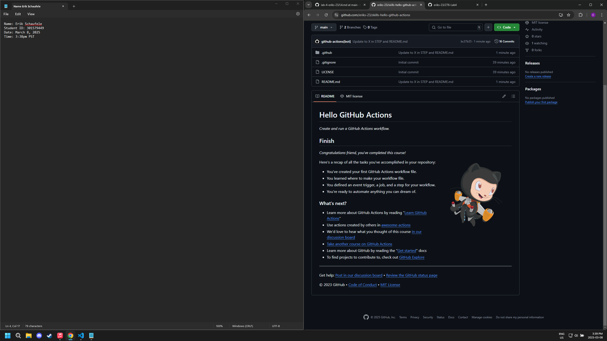
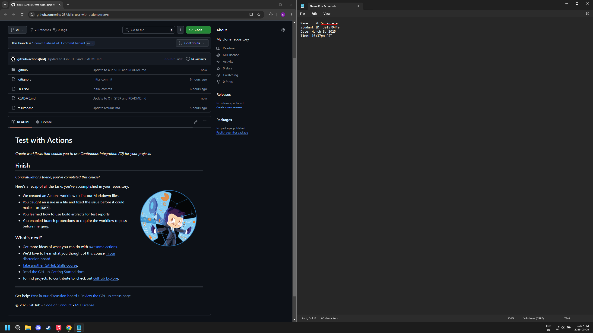

# 276 Lab 4

# GitHub Skills

## GitHub Actions Hello

## GitHub Test With Actions

# Docker Videos + Questions

1. Explain in your own words why Docker can be beneficial for developers working in teams.

Docker uses containers to run applications in isolated environments. This can allow for easier sharing of an application to other people on a team and letting it run in an isolated environment can help eliminate the issue of the application running on one team members computer while not being able to run on another team members computer because they have different environments. This makes it so that each team member doesn't need the same version of Node JS for example installed just to run the application; eliminating the setup process to run the application.

2. Compare and contrast Docker containers and virtual machines as discussed in the video. What are some key differences in how they manage resources and dependencies?

A container shares the host computer's OS this makes it lighter and more nimble. A Virtual Machine has its own entire OS making it heftier to run.

3. Discuss the significance of Docker images being read-only. How might this feature be advantageous or disadvantageous in application development?

Advantages of images being read-only include: keeping them more secure, reducing the risk of incorrect modifications and allowing for easier rollback since there will be a previous copy of the image.
Disadvantages of images being read-only could be a lack of flexibility even for small changes and an increase in storage that the total number of images will take up.